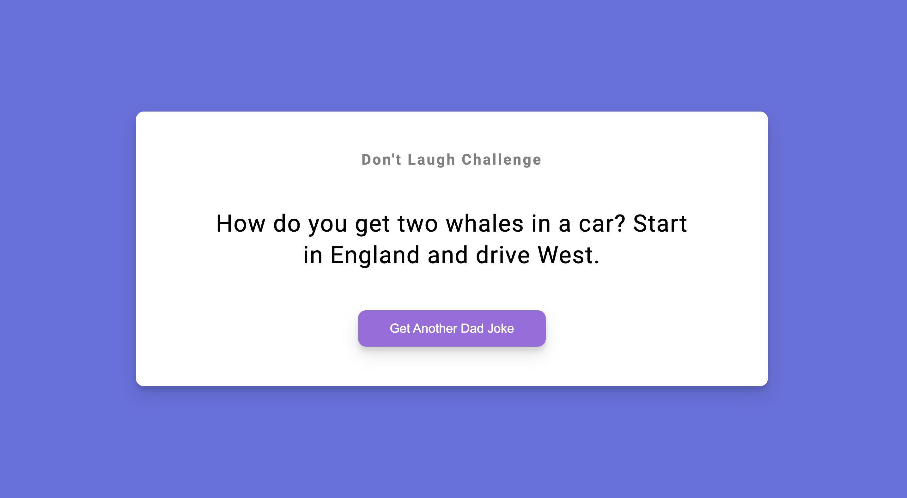

# 50 Projects in 50 Days - Dad Jokes

This is a code along project in the [50 Projects In 50 Days - HTML, CSS & JavaScript Udemy Course](https://www.udemy.com/course/50-projects-50-days/). Sharpen your skills by building 50 quick, unique & fun mini projects.

## Table of contents 😌

- [Overview](#overview)
  - [The project](#the-project)
  - [Screenshot](#screenshot)
  - [Links](#links)
- [My process](#my-process)
  - [Built with](#built-with)
  - [What I learned](#what-i-learned)
  - [Continued development](#continued-development)
  - [Code snippets](#im-really-proud-of-these-code-snippets%EF%B8%8F)
  - [Useful resources](#useful-resources)
- [Author](#author)
- [Acknowledgments](#acknowledgments)

## Overview👋🏾

Welcome to the 10<sup>th</sup> mini-project of the course!

### The project😥

In this project users will be able to:

- Build a site that utilizes an API to access data.

### Screenshot🌇



### Links👩🏾‍💻

- Solution URL: (https://github.com/MaianneThornton/50in50_DadJokes)
- Live Site URL: (https://elegant-heliotrope-46c3b7.netlify.app/)

## My process💭

This is a simple project that I started by marking out initial classes and id's in the html file to be later used for styling. Next I began styling the css by styling the container, heading, and button. I then added functionality by way of JavaScript to switch between classes when the user clicks on a button.

### Built with👷🏾‍♀️

- Semantic HTML5 markup
- CSS custom properties
- Flexbox
- JavaScript
- Asynchronous API

### What I learned👩🏾‍🏫

I reviewed the logic behind accessing an API as well as two methods of getting data: using the .then and using the async/await methods. I will be applying this to future projects where needed.

### Continued development🔮

In the future I plan on continuing to practice using the different methods to access API's.

I also plan on continuing to practice using event listeners to make my pages more functional.

I also plan on continuing to learn the best ways to phrase git commits, so that future viewers can fully understand the changes that have occurred.

### I'm really proud of these code snippets✂️

```css
.container {
  background-color: #fff;
  border-radius: 0.625rem;
  box-shadow: 0 0.625rem 1.25rem rgba(0, 0, 0, 0.1), 0 0.375rem 0.375rem rgba(0, 0, 0, 0.1);
  padding: 3.125rem 1.25rem;
  text-align: center;
  max-width: 100%;
  width: 50rem;
}
```

```js
async function generateJoke() {
  const config = {
    headers: {
      Accept: 'application/json',
    },
  };

  const res = await fetch('https://icanhazdadjoke.com', config);

  const data = await res.json();

  jokeElem.innerHTML = data.joke;
}
```

### Useful resources📖

- [Resource](https://developer.mozilla.org/en-US/docs/Web/API/Fetch_API/Using_Fetch) - This is an amazing article which describes how to use the Fetch API. I'd recommend it to anyone still learning this concept.

## Author🔎

- Website - [Portfolio Site](https://www.maiannethornton.com/Portfolio/index.html)
- Frontend Mentor - [@MaianneThornton](https://www.frontendmentor.io/profile/MaianneThornton)
- GitHub - [@MaianneThornton](GitHub.com/MaianneThornton)
- Twitter - [@MaianneThornton](https://twitter.com/MaianneThornton)
- LinkedIn - [@MaianneThornton](https://www.linkedin.com/in/maiannethornton/)

## Acknowledgments🙏🏾

Special Thanks go to [Brad Traversy](http://www.traversymedia.com/) and [Florin Pop](http://www.florin-pop.com/) creating the course and making reviewing concepts fun 😊.
